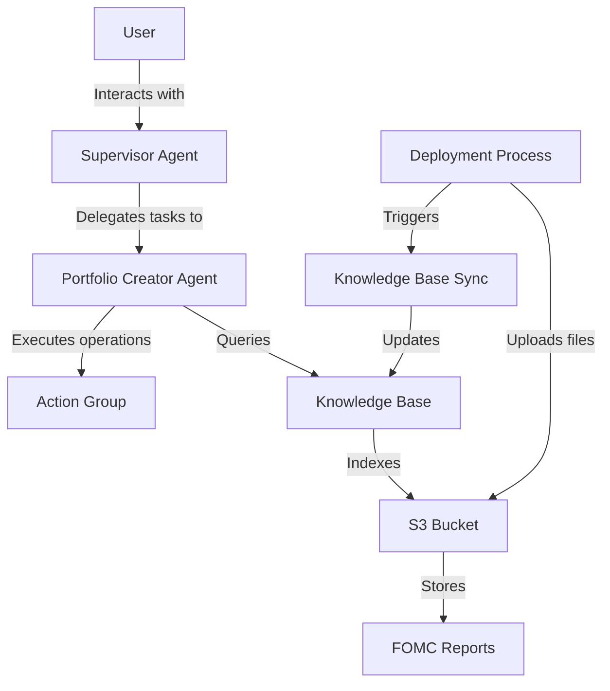
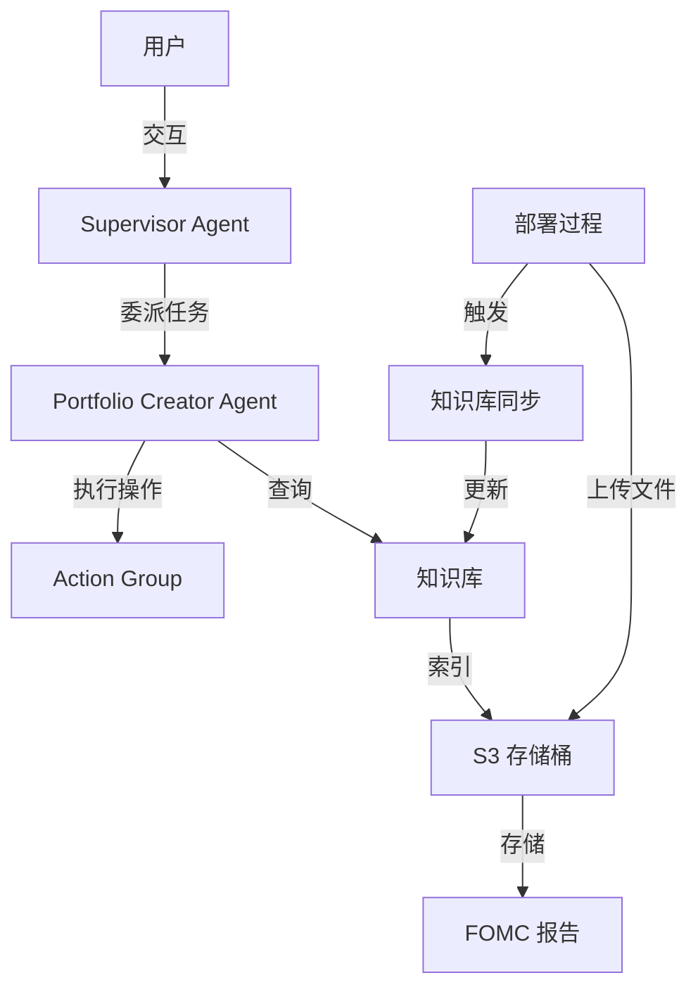

# Portfolio Creator Multi-Bedrock Agents Architecture Design

## Project Overview

Portfolio Creator Multi-Bedrock Agents is a multi-agent system built with AWS Bedrock for creating investment portfolios and analyzing FOMC (Federal Open Market Committee) reports. The system consists of two main agents: Portfolio Creator Agent and Supervisor Agent, working together to provide investment portfolio creation and economic analysis services.

[中文版本](#portfolio-creator-multi-bedrock-agents-架构设计-中文)

## System Architecture

The system uses an Infrastructure as Code (IaC) approach based on AWS CDK, with all AWS resources defined in TypeScript. The entire system is deployed as a single CloudFormation stack containing multiple interconnected components.

## Core Components

### 1. Supervisor Agent

The Supervisor Agent is the main entry point of the system, responsible for receiving user requests and delegating tasks to the specialized Portfolio Creator Agent.

**Key Features:**

- Uses Claude Haiku model
- Configured in SUPERVISOR mode
- Manages collaboration with Portfolio Creator Agent

### 2. Portfolio Creator Agent

The Portfolio Creator Agent specializes in creating investment portfolios and analyzing FOMC reports.

**Key Features:**

- Uses Claude Haiku model
- Integrates with knowledge base to access FOMC reports
- Implements custom Action Group to perform specific operations

### 3. Knowledge Base

The knowledge base is the system's data source, storing and indexing FOMC reports to allow the Portfolio Creator Agent to access and analyze this information.

**Key Features:**

- Uses Titan Embed Text V2 model for embeddings
- Configured to read data from S3 bucket
- Uses fixed-size chunking strategy for text processing

### 4. S3 Bucket

The S3 bucket is used to store FOMC report documents as the data source for the knowledge base.

**Key Features:**

- Security configuration (enforced SSL, blocked public access)
- Versioning
- Integration with knowledge base

### 5. File Synchronization Mechanism

During the deployment process, the system uploads local documents to the S3 bucket and triggers knowledge base synchronization.

**Key Features:**

- Uses S3 deployment construct to upload files
- Uses custom resource to trigger knowledge base synchronization
- Ensures file upload is completed before triggering synchronization

## Data Flow

1. **User Request Flow**:

   - User sends a request to the Supervisor Agent
   - Supervisor Agent analyzes the request and decides whether to delegate to the Portfolio Creator Agent
   - Portfolio Creator Agent processes the request, potentially querying the knowledge base or executing operations
   - Results are returned to the Supervisor Agent, then to the user

2. **Knowledge Base Update Flow**:
   - Deployment process uploads documents to the S3 bucket
   - After upload completion, knowledge base synchronization is triggered
   - Knowledge base processes documents and creates vector indexes
   - Portfolio Creator Agent can query the updated knowledge base

## Technology Stack

- **Infrastructure**: AWS CDK (TypeScript)
- **AI Services**: Amazon Bedrock (Claude Haiku, Titan Embed)
- **Storage**: Amazon S3
- **Compute**: AWS Lambda
- **Deployment**: AWS CloudFormation

## Security Considerations

- S3 bucket configured with enforced SSL and blocked public access
- Lambda functions use the principle of least privilege
- Resource naming uses unique identifiers to avoid conflicts

## Scalability Considerations

The system is designed with a modular architecture that can be extended in the following ways:

1. **Adding More Agents**: Additional specialized agents can be created and added as collaborators to the Supervisor Agent
2. **Expanding the Knowledge Base**: More data sources can be added, such as market data, company reports, etc.
3. **Enhancing Action Group**: More operations can be added, such as sending emails, generating reports, etc.

## Future Improvements

1. **Real-time Data Synchronization**: Implement S3 event-triggered knowledge base synchronization for automatic indexing of newly uploaded documents
2. **User Interface**: Add a web interface for easier user interaction with the system
3. **Multimodal Support**: Extend the system to handle image and tabular data
4. **Performance Optimization**: Implement caching and batch processing mechanisms to improve system response time

---

# Portfolio Creator Multi-Bedrock Agents 架构设计 (中文)

## 项目概述

Portfolio Creator Multi-Bedrock Agents 是一个使用 AWS Bedrock 构建的多智能体系统，用于创建投资组合和分析 FOMC（美联储公开市场委员会）报告。该系统由两个主要的智能体组成：Portfolio Creator Agent 和 Supervisor Agent，它们协同工作，为用户提供投资组合创建和经济分析服务。

[English Version](#portfolio-creator-multi-bedrock-agents-architecture-design)

## 系统架构

系统采用了基于 AWS CDK 的基础设施即代码（IaC）方法，使用 TypeScript 定义所有 AWS 资源。整个系统部署为单个 CloudFormation 堆栈，包含多个相互关联的组件。

## 核心组件

### 1. Supervisor Agent

Supervisor Agent 是系统的主要入口点，负责接收用户请求并将任务委派给专业的 Portfolio Creator Agent。

**关键特性：**

- 使用 Claude Haiku 模型
- 配置为 SUPERVISOR 模式
- 管理与 Portfolio Creator Agent 的协作

### 2. Portfolio Creator Agent

Portfolio Creator Agent 是专门负责创建投资组合和分析 FOMC 报告的智能体。

**关键特性：**

- 使用 Claude Haiku 模型
- 集成知识库以访问 FOMC 报告
- 实现自定义 Action Group 以执行特定操作

### 3. 知识库

知识库是系统的数据源，存储和索引 FOMC 报告，使 Portfolio Creator Agent 能够访问和分析这些信息。

**关键特性：**

- 使用 Titan Embed Text V2 模型进行嵌入
- 配置为从 S3 存储桶读取数据
- 使用固定大小的分块策略进行文本处理

### 4. S3 存储桶

S3 存储桶用于存储 FOMC 报告文档，作为知识库的数据源。

**关键特性：**

- 安全配置（强制 SSL，阻止公共访问）
- 版本控制
- 与知识库集成

### 5. 文件同步机制

在部署过程中，系统会将本地文档上传到 S3 存储桶，并触发知识库同步。

**关键特性：**

- 使用 S3 部署构造上传文件
- 使用自定义资源触发知识库同步
- 确保文件上传完成后再触发同步

## 数据流

1. **用户请求流程**：

   - 用户向 Supervisor Agent 发送请求
   - Supervisor Agent 分析请求并决定是否委派给 Portfolio Creator Agent
   - Portfolio Creator Agent 处理请求，可能查询知识库或执行操作
   - 结果返回给 Supervisor Agent，然后返回给用户

2. **知识库更新流程**：
   - 部署过程将文档上传到 S3 存储桶
   - 上传完成后触发知识库同步
   - 知识库处理文档并创建向量索引
   - Portfolio Creator Agent 可以查询更新后的知识库

## 技术栈

- **基础设施**：AWS CDK (TypeScript)
- **AI 服务**：Amazon Bedrock (Claude Haiku, Titan Embed)
- **存储**：Amazon S3
- **计算**：AWS Lambda
- **部署**：AWS CloudFormation

## 安全考虑

- S3 存储桶配置了强制 SSL 和阻止公共访问
- Lambda 函数使用最小权限原则
- 资源命名使用唯一标识符，避免冲突

## 扩展性考虑

系统设计为模块化架构，可以通过以下方式扩展：

1. **添加更多智能体**：可以创建更多专业智能体，并将其添加为 Supervisor Agent 的协作者
2. **扩展知识库**：可以添加更多数据源，如市场数据、公司财报等
3. **增强 Action Group**：可以添加更多操作，如发送电子邮件、生成报告等

## 未来改进

1. **实时数据同步**：实现 S3 事件触发知识库同步，使新上传的文档自动被索引
2. **用户界面**：添加 Web 界面，使用户可以更方便地与系统交互
3. **多模态支持**：扩展系统以处理图像和表格数据
4. **性能优化**：实现缓存和批处理机制，提高系统响应速度
