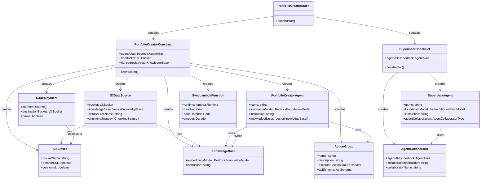

# Portfolio Creator Multi-Bedrock Agents Component Design

## Component Overview

This document details the various components of the Portfolio Creator Multi-Bedrock Agents system and their interactions. The system employs a modular design with multiple collaborating components that together provide investment portfolio creation and FOMC report analysis capabilities.

[中文版本](#portfolio-creator-multi-bedrock-agents-组件设计-中文)

## Component Architecture Diagram

## Core Component Details

### 1. PortfolioCreatorStack

This is the main stack of the system, containing all other components. It coordinates the creation and configuration of PortfolioCreatorConstruct and SupervisorConstruct.

**Main Responsibilities:**

- Create and configure PortfolioCreatorConstruct
- Create and configure SupervisorConstruct
- Manage dependencies between components
- Output important resource IDs

### 2. PortfolioCreatorConstruct

This construct is responsible for creating and configuring the Portfolio Creator Agent and its related resources.

**Main Components:**

- S3 Bucket: Used to store FOMC reports
- Knowledge Base: Used to index and query FOMC reports
- S3 Data Source: Connects S3 bucket and knowledge base
- Portfolio Creator Agent: Handles investment portfolio creation and FOMC report analysis
- Action Group: Defines operations that the Agent can perform
- S3 Deployment: Deploys local files to S3 bucket
- Sync Lambda Function: Triggers knowledge base synchronization

**Configuration Parameters:**

- uniqueSuffix: Used to generate unique resource names

### 3. SupervisorConstruct

This construct is responsible for creating and configuring the Supervisor Agent and its related resources.

**Main Components:**

- Supervisor Agent: The main entry point of the system
- Agent Collaborator: Connects Supervisor Agent and Portfolio Creator Agent

**Configuration Parameters:**

- portfolioCreatorAgentAlias: The alias of the Portfolio Creator Agent
- uniqueSuffix: Used to generate unique resource names

### 4. S3 Bucket

S3 bucket used to store FOMC report documents.

**Key Features:**

- Enforced SSL
- Versioning
- Blocked public access
- S3-managed encryption
- Auto-delete objects (when bucket is deleted)

### 5. Knowledge Base

Bedrock knowledge base used to index and query FOMC reports.

**Key Features:**

- Uses Titan Embed Text V2 model for embeddings
- Custom instruction optimized for understanding FOMC reports

### 6. S3 Data Source

Data source connecting S3 bucket and knowledge base.

**Key Features:**

- Fixed-size chunking strategy (500 tokens, 20% overlap)
- Data source name: "fomc-reports"

### 7. Portfolio Creator Agent

Bedrock Agent specialized in creating investment portfolios and analyzing FOMC reports.

**Key Features:**

- Uses Claude Haiku model
- Integrates with knowledge base
- Custom instruction optimized for investment portfolio creation and FOMC report analysis

### 8. Supervisor Agent

The main entry point of the system, responsible for receiving user requests and delegating tasks to the Portfolio Creator Agent.

**Key Features:**

- Uses Claude Haiku model
- Configured in SUPERVISOR mode
- Custom instruction optimized for task delegation and result integration

### 9. Action Group

Defines operations that the Portfolio Creator Agent can perform.

**Key Features:**

- Implemented by Lambda function
- Custom API schema defining operation parameters and return values

### 10. Agent Collaborator

Connects Supervisor Agent and Portfolio Creator Agent.

**Key Features:**

- Custom collaboration instruction optimized for task delegation and result integration
- Collaborator name: "portfolio-creator"

### 11. Sync Lambda Function

Lambda function that triggers knowledge base synchronization.

**Key Features:**

- Python 3.12 runtime
- 15-minute timeout
- Calls Bedrock API to start ingestion job
- Waits for ingestion job completion

### 12. S3 Deployment

Deployment mechanism that deploys local files to S3 bucket.

**Key Features:**

- Source directory: docs/assets
- Destination: S3 bucket
- Does not delete existing files (prune: false)

## Component Interaction Flows

### Deployment Flow

1. Create PortfolioCreatorStack
2. Create PortfolioCreatorConstruct
   - Create S3 bucket
   - Create knowledge base
   - Create S3 data source
   - Create Portfolio Creator Agent
   - Create Action Group
   - Add Action Group to Agent
   - Create Agent alias
3. Create SupervisorConstruct
   - Create Supervisor Agent
   - Create Agent Collaborator
   - Add Collaborator to Agent
   - Create Agent alias
4. Deploy files to S3 bucket
5. Trigger knowledge base synchronization

### Runtime Flow

1. User sends a request to Supervisor Agent
2. Supervisor Agent analyzes the request
3. If needed, Supervisor Agent delegates the task to Portfolio Creator Agent
4. Portfolio Creator Agent processes the request
   - If needed, queries knowledge base for FOMC report information
   - If needed, executes operations in Action Group
5. Portfolio Creator Agent returns results to Supervisor Agent
6. Supervisor Agent integrates results and returns to user

## Configuration Parameters

The main configuration parameters of the system include:

- **uniqueSuffix**: Used to generate unique resource names, based on stack ID
- **Knowledge Base Instruction**: Optimizes knowledge base understanding of FOMC reports
- **Agent Instructions**: Optimize Agent understanding and execution of tasks
- **Collaboration Instructions**: Optimize collaboration between Agents
- **Chunking Strategy**: Controls how documents are split and indexed

## Extension Points

The system is designed with multiple extension points for future enhancements:

1. **Adding More Agents**: Additional specialized agents can be created and added as collaborators to the Supervisor Agent
2. **Expanding the Knowledge Base**: More data sources can be added, such as market data, company reports, etc.
3. **Enhancing Action Group**: More operations can be added, such as sending emails, generating reports, etc.
4. **Real-time Data Synchronization**: S3 event-triggered knowledge base synchronization can be implemented

---

# Portfolio Creator Multi-Bedrock Agents 组件设计 (中文)

## 组件概述

本文档详细描述了 Portfolio Creator Multi-Bedrock Agents 系统的各个组件及其交互关系。系统采用模块化设计，由多个相互协作的组件组成，共同提供投资组合创建和 FOMC 报告分析功能。

[English Version](#portfolio-creator-multi-bedrock-agents-component-design)

## 组件架构图

## 核心组件详细说明

### 1. PortfolioCreatorStack

这是系统的主要堆栈，包含所有其他组件。它负责协调 PortfolioCreatorConstruct 和 SupervisorConstruct 的创建和配置。

**主要职责：**

- 创建和配置 PortfolioCreatorConstruct
- 创建和配置 SupervisorConstruct
- 管理组件之间的依赖关系
- 输出重要资源的 ID

### 2. PortfolioCreatorConstruct

这是负责创建和配置 Portfolio Creator Agent 及其相关资源的构造。

**主要组件：**

- S3 存储桶：用于存储 FOMC 报告
- 知识库：用于索引和查询 FOMC 报告
- S3 数据源：连接 S3 存储桶和知识库
- Portfolio Creator Agent：处理投资组合创建和 FOMC 报告分析
- Action Group：定义 Agent 可以执行的操作
- S3 部署：将本地文件部署到 S3 存储桶
- 同步 Lambda 函数：触发知识库同步

**配置参数：**

- uniqueSuffix：用于生成唯一资源名称

### 3. SupervisorConstruct

这是负责创建和配置 Supervisor Agent 及其相关资源的构造。

**主要组件：**

- Supervisor Agent：系统的主要入口点
- Agent Collaborator：连接 Supervisor Agent 和 Portfolio Creator Agent

**配置参数：**

- portfolioCreatorAgentAlias：Portfolio Creator Agent 的别名
- uniqueSuffix：用于生成唯一资源名称

### 4. S3 存储桶

用于存储 FOMC 报告文档的 S3 存储桶。

**主要特性：**

- 强制 SSL
- 版本控制
- 阻止公共访问
- S3 托管加密
- 自动删除对象（当存储桶被删除时）

### 5. 知识库

用于索引和查询 FOMC 报告的 Bedrock 知识库。

**主要特性：**

- 使用 Titan Embed Text V2 模型进行嵌入
- 自定义指令，优化对 FOMC 报告的理解

### 6. S3 数据源

连接 S3 存储桶和知识库的数据源。

**主要特性：**

- 固定大小的分块策略（500 个标记，20%重叠）
- 数据源名称："fomc-reports"

### 7. Portfolio Creator Agent

专门负责创建投资组合和分析 FOMC 报告的 Bedrock Agent。

**主要特性：**

- 使用 Claude Haiku 模型
- 集成知识库
- 自定义指令，优化对投资组合创建和 FOMC 报告分析的理解

### 8. Supervisor Agent

系统的主要入口点，负责接收用户请求并将任务委派给 Portfolio Creator Agent。

**主要特性：**

- 使用 Claude Haiku 模型
- 配置为 SUPERVISOR 模式
- 自定义指令，优化任务委派和结果整合

### 9. Action Group

定义 Portfolio Creator Agent 可以执行的操作。

**主要特性：**

- 由 Lambda 函数实现
- 自定义 API 模式，定义操作的参数和返回值

### 10. Agent Collaborator

连接 Supervisor Agent 和 Portfolio Creator Agent 的协作者。

**主要特性：**

- 自定义协作指令，优化任务委派和结果整合
- 协作者名称："portfolio-creator"

### 11. 同步 Lambda 函数

触发知识库同步的 Lambda 函数。

**主要特性：**

- Python 3.9 运行时
- 15 分钟超时
- 调用 Bedrock API 启动摄取作业
- 等待摄取作业完成

### 12. S3 部署

将本地文件部署到 S3 存储桶的部署机制。

**主要特性：**

- 源目录：docs/assets
- 目标：S3 存储桶
- 不删除现有文件（prune: false）

## 组件交互流程

### 部署流程

1. 创建 PortfolioCreatorStack
2. 创建 PortfolioCreatorConstruct
   - 创建 S3 存储桶
   - 创建知识库
   - 创建 S3 数据源
   - 创建 Portfolio Creator Agent
   - 创建 Action Group
   - 将 Action Group 添加到 Agent
   - 创建 Agent 别名
3. 创建 SupervisorConstruct
   - 创建 Supervisor Agent
   - 创建 Agent Collaborator
   - 将 Collaborator 添加到 Agent
   - 创建 Agent 别名
4. 部署文件到 S3 存储桶
5. 触发知识库同步

### 运行时流程

1. 用户向 Supervisor Agent 发送请求
2. Supervisor Agent 分析请求
3. 如果需要，Supervisor Agent 将任务委派给 Portfolio Creator Agent
4. Portfolio Creator Agent 处理请求
   - 如果需要，查询知识库获取 FOMC 报告信息
   - 如果需要，执行 Action Group 中的操作
5. Portfolio Creator Agent 将结果返回给 Supervisor Agent
6. Supervisor Agent 整合结果并返回给用户

## 配置参数

系统的主要配置参数包括：

- **uniqueSuffix**：用于生成唯一资源名称，基于堆栈 ID
- **知识库指令**：优化知识库对 FOMC 报告的理解
- **Agent 指令**：优化 Agent 对任务的理解和执行
- **协作指令**：优化 Agent 之间的协作
- **分块策略**：控制文档如何被分割和索引

## 扩展点

系统设计了多个扩展点，允许未来的增强：

1. **添加更多 Agent**：可以创建更多专业 Agent，并将其添加为 Supervisor Agent 的协作者
2. **扩展知识库**：可以添加更多数据源，如市场数据、公司财报等
3. **增强 Action Group**：可以添加更多操作，如发送电子邮件、生成报告等
4. **实时数据同步**：可以实现 S3 事件触发知识库同步
