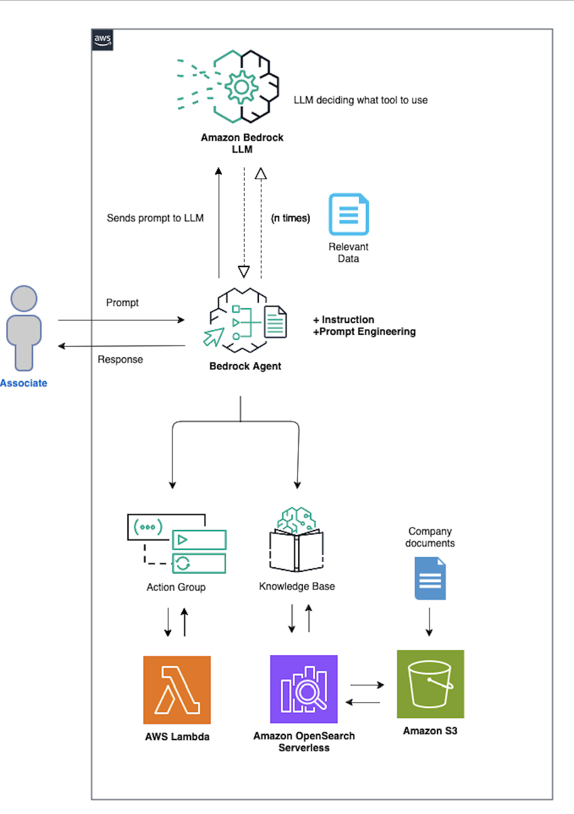
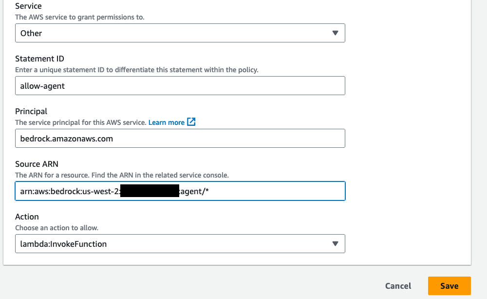

## Introduction

This workshop details the setup process of an application that will use an agent on Amazon Bedrock. This will include setting up Amazon S3 buckets, a knowledge base, action group, AWS Lambda function, and an Amazon EC2 instance within an AWS environment. We will use the Streamlit framework for the user interface(Optional). The agent is designed to create an ROI company portfolio automatically. We will also create Q&A capability by setting up an internal knowledge base that references several open committee meeting reports. This workshop will also provide partial functionality for a send email capability, but will not be fully enabled. This is to simply show the art of the possible. Additionally, you have access to another sectoin of the workshop that covers Amazon Bedrock multi-agent collaboration.

## There are 5 modules in this workshop:

- Setup Amazon S3 buckets
- Setup AWS Lambda function
- Setup agent and Action group
- Setup Knowledge base with Amazon Bedrock agent
- Testing the Setup

## Architecture

This workshop details the setup process of an application that will use an agent on Amazon Bedrock. In an AWS environment, you will be setting up S3 buckets, a knowledge base, action group, Lambda function, and an EC2 instance(optional). We will use the Streamlit framework for the user interface. The agent is designed to dynamically create a top profit company portfolio based on specific parameters, and providing a Q&A capability for Federal Open Market Committee reports. This workshop will also include a send email method, but will not be enabled. Below is a diagram of what we will be building out.



The AWS Services that are used in this workshop are:

Amazon Bedrock is a comprehensive, serverless service that simplifies the development of generative AI applications by providing access to top-tier foundation models from leading AI companies through a single API, along with customization options and seamless integration with familiar AWS services.

Amazon S3 (Simple Storage Service) offers scalable object storage for data backup, archival, and analytics, with 99.999999999% (11 9's) of durability and stores data for millions of applications.

AWS Lambda lets you run code without provisioning or managing servers. You pay only for the compute time you consume, making it a cost-effective solution to run code in response to HTTP requests via Amazon API Gateway, event triggers, or direct calls.

Amazon OpenSearch Serverless is a scalable and fully managed service for deploying, operating, and scaling OpenSearch clusters in the AWS Cloud.

Amazon EC2 Instance is a resizable virtual server in the cloud that provides secure and scalable compute capacity. You can run various workloads on EC2 instances, ranging from small-scale applications to large-scale distributed systems. EC2 gives you full control over your compute resources and allows you to scale up or down as your needs change. It supports multiple operating systems and is tightly integrated with other AWS services, making it a versatile option for deploying applications in the cloud.

AWS CloudFormation template is a JSON or YAML formatted text file that defines the infrastructure and resources you want to provision in AWS. With CloudFormation, you can model and set up your AWS resources so that you can spend less time managing those resources and more time focusing on your applications. It allows you to automate the creation and management of your AWS environment, ensuring consistent and repeatable deployment of infrastructure across multiple regions and accounts.

## Storyline

我们模拟一个客户需要根据报告来创建投资 portolio，具体的故事背景如下。

Setting the Scene: In the bustling city of New York, amidst towering skyscrapers and the constant hum of commerce, there lies a small yet innovative investment startup, AnyCompany Portfolios Inc. The team is diverse, passionate, and driven by the belief that technology can unlock untapped potential in the world of finance and business intelligence.

The Problem: Despite the advancements in technology, the startup notices a significant gap in the market. Financial analysts and investors spend countless hours manually researching companies, often relying on outdated or superficial data. This tedious process not only limits the potential of creating high value investment portfolios, but also leaves smaller, yet promising companies overshadowed by industry giants.

The Inspiration: The team realizes that there is a wealth of proprietary data – a treasure trove of insights and opportunities – that remains largely untapped. They envision a GenerativeAI application that can shift through this data, identifying key patterns and profitable trends invisible to the human eye.

The Challenge: However, the journey isn't straightforward. Developing a Generative AI application capable of handling text summarazation, chatbot with proprietary data, and dynamically create investment company portfolios requires innovative thinking, and a deep understanding of both technology and finance.

The Solution: The team starts building an application that can not only analyze vast amounts of company data, but also able to search through dozens of ingested Federal Open Market Committee reports to identify top company profit earners. This allows for a nuanced understanding of the market dynamics and more informed decision-making.

The Impact: The application revolutionizes the way investors and analysts approach company research and analysis. No longer confined to traditional methods, they can now access deeper insights, discover hidden gems in the market, and make more strategic investment decisions faster than ever before.

The Invitation: And now, we invite you to be a part of this groundbreaking journey. Through our workshop, you'll learn how to harness the power of agents in Amazon Bedrock in transforming data into opportunities, shaping the future of financial analysis and investment!

## Module 1 - Setup Amazon S3 Buckets and Knowledge base

Domain Data Bucket: Navigate to the Amazon S3 console and create an S3 bucket. Use the default settings. This S3 bucket will be used to store the domain data that the Agent will later use to answer domain specifc questions. Call the S3 bucket knowledgebase-bedrock-agent-portfolio-creator-{randomId}. We will use the default settings.

upload all the 6 reports (pdf files) in ../reports folder to S3 bucket.

Now, we will create a knowledge base and Sync S3 bucket we just created to this knowledge base. For the embedding model, choose Amazon: Titan Text Embeddings V2. sync the s3 data with knowledge base when it's created.

## Module 2 - Setup AWS Lambda function

Create a Lambda function (Python 3.12) for the Bedrock agent's action group. We will call this Lambda function PortfolioCreator-actions. We are creating this function for an action group in order to carry out various tasks.

The Lambda function serves as a backend API for the AI agent that will be created to access and retrieve company-related data. It provides the following functionality:

- Company Research: Allows the AI agent to search for a specific company by name and retrieve its details.

- Portfolio Creation: Enables the AI agent to create a portfolio of top-performing companies within a specified industry sector. The agent can specify the number of companies to include in the portfolio, and the function will return the top companies sorted by profit in descending order.

- Email Sending: Allows the AI agent to simulate sending an email containing a portfolio summary to a specified email address.

The Lambda function uses predefined mock data for demonstration purposes. It parses the incoming API requests, routes them to the appropriate handler functions, and returns the response in a structured format.

The python code for this lambda function are as follows:

```python
import json

def lambda_handler(event, context):
    print(event)

    # Mock data for demonstration purposes
    company_data = [
        #Technology Industry
        {"companyId": 1, "companyName": "TechStashNova Inc.", "industrySector": "Technology", "revenue": 10000, "expenses": 3000, "profit": 7000, "employees": 10},
        {"companyId": 2, "companyName": "QuantumPirateLeap Technologies", "industrySector": "Technology", "revenue": 20000, "expenses": 4000, "profit": 16000, "employees": 10},
        {"companyId": 3, "companyName": "CyberCipherSecure IT", "industrySector": "Technology", "revenue": 30000, "expenses": 5000, "profit": 25000, "employees": 10},
        {"companyId": 4, "companyName": "DigitalMyricalDreams Gaming", "industrySector": "Technology", "revenue": 40000, "expenses": 6000, "profit": 34000, "employees": 10},
        {"companyId": 5, "companyName": "NanoMedNoLand Pharmaceuticals", "industrySector": "Technology", "revenue": 50000, "expenses": 7000, "profit": 43000, "employees": 10},
        {"companyId": 6, "companyName": "RoboSuperBombTech Industries", "industrySector": "Technology", "revenue": 60000, "expenses": 8000, "profit": 52000, "employees": 12},
        {"companyId": 7, "companyName": "FuturePastNet Solutions", "industrySector": "Technology",  "revenue": 60000, "expenses": 9000, "profit": 51000, "employees": 10},
        {"companyId": 8, "companyName": "InnovativeCreativeAI Corp", "industrySector": "Technology", "revenue": 65000, "expenses": 10000, "profit": 55000, "employees": 15},
        {"companyId": 9, "companyName": "EcoLeekoTech Energy", "industrySector": "Technology", "revenue": 70000, "expenses": 11000, "profit": 59000, "employees": 10},
        {"companyId": 10, "companyName": "TechyWealthHealth Systems", "industrySector": "Technology", "revenue": 80000, "expenses": 12000, "profit": 68000, "employees": 10},

        #Real Estate Industry
        {"companyId": 11, "companyName": "LuxuryToNiceLiving Real Estate", "industrySector": "Real Estate", "revenue": 90000, "expenses": 13000, "profit": 77000, "employees": 10},
        {"companyId": 12, "companyName": "UrbanTurbanDevelopers Inc.", "industrySector": "Real Estate", "revenue": 100000, "expenses": 14000, "profit": 86000, "employees": 10},
        {"companyId": 13, "companyName": "SkyLowHigh Towers", "industrySector": "Real Estate", "revenue": 110000, "expenses": 15000, "profit": 95000, "employees": 18},
        {"companyId": 14, "companyName": "GreenBrownSpace Properties", "industrySector": "Real Estate", "revenue": 120000, "expenses": 16000, "profit": 104000, "employees": 10},
        {"companyId": 15, "companyName": "ModernFutureHomes Ltd.", "industrySector": "Real Estate", "revenue": 130000, "expenses": 17000, "profit": 113000, "employees": 10},
        {"companyId": 16, "companyName": "CityCountycape Estates", "industrySector": "Real Estate", "revenue": 140000, "expenses": 18000, "profit": 122000, "employees": 10},
        {"companyId": 17, "companyName": "CoastalFocalRealty Group", "industrySector": "Real Estate", "revenue": 150000, "expenses": 19000, "profit": 131000, "employees": 10},
        {"companyId": 18, "companyName": "InnovativeModernLiving Spaces", "industrySector": "Real Estate", "revenue": 160000, "expenses": 20000, "profit": 140000, "employees": 10},
        {"companyId": 19, "companyName": "GlobalRegional Properties Alliance", "industrySector": "Real Estate", "revenue": 170000, "expenses": 21000, "profit": 149000, "employees": 11},
        {"companyId": 20, "companyName": "NextGenPast Residences", "industrySector": "Real Estate", "revenue": 180000, "expenses": 22000, "profit": 158000, "employees": 260}
    ]

    def get_named_parameter(event, name):
        '''Function searches through the parameters list in the event dictionary and returns the value of the parameter whose name matches the provided name string'''

        return next(item for item in event['parameters'] if item['name'] == name)['value']

    def companyResearch(event):
        '''Searches for a company based on the 'name' parameter in the lambda event and returns its information if found.'''

        companyName = get_named_parameter(event, 'name').lower()
        print("NAME PRINTED: ", companyName)

        for company_info in company_data:
            if company_info["companyName"].lower() == companyName:
                return company_info
        return None

    def createPortfolio(event, company_data):
        '''Creates a portfolio of top companies based on the 'numCompanies' and 'industry' parameters in the lambda event.'''

        numCompanies = int(get_named_parameter(event, 'numCompanies'))
        industry = get_named_parameter(event, 'industry').lower()

        industry_filtered_companies = [company for company in company_data
                                       if company['industrySector'].lower() == industry]

        sorted_companies = sorted(industry_filtered_companies, key=lambda x: x['profit'], reverse=True)

        top_companies = sorted_companies[:numCompanies]
        return top_companies


    def sendEmail(event, company_data):
        '''Prepares and sends an email with a summary report and portfolio details based on parameters in the lambda event.'''

        emailAddress = get_named_parameter(event, 'emailAddress')
        fomcSummary = get_named_parameter(event, 'fomcSummary')

        # Retrieve the portfolio data as a string
        portfolioDataString = get_named_parameter(event, 'portfolio')


        # Prepare the email content
        email_subject = "Company Portfolio and Search Results Summary Report"
        #email_body = f"Search Summary Report:\n{fomcSummary}\n\nPortfolio Details:\n{json.dumps(portfolioData, indent=4)}"

        # Email sending code here (commented out for now)

        return "Email sent successfully to {}".format(emailAddress)


    result = ''
    response_code = 200
    action_group = event['actionGroup']
    api_path = event['apiPath']

    print("api_path: ", api_path )

    if api_path == '/companyResearch':
        result = companyResearch(event)
    elif api_path == '/createPortfolio':
        result = createPortfolio(event, company_data)
    elif api_path == '/sendEmail':
        result = sendEmail(event, company_data)
    else:
        response_code = 404
        result = f"Unrecognized api path: {action_group}::{api_path}"

    response_body = {
        'application/json': {
            'body': result
        }
    }

    action_response = {
        'actionGroup': event['actionGroup'],
        'apiPath': event['apiPath'],
        'httpMethod': event['httpMethod'],
        'httpStatusCode': response_code,
        'responseBody': response_body
    }

    api_response = {'messageVersion': '1.0', 'response': action_response}
    return api_response

```

Next, apply a resource policy to the Lambda to grant Bedrock agent access. To do this, we will switch the top tab from code to configuration and the side tab to Permissions. Then, scroll to the Resource-based policy statements section and click the Add permissions button.

Select AWS service, then use the following settings to configure the resource based policy:
Service - Other
Statement ID - allow-bedrock-agent
Principal - bedrock.amazonaws.com
Source ARN - arn:aws:bedrock:us-west-2:{account-id}:agent/_ - (Please note, AWS recommends least privilage so only an allowed agent can invoke this Lambda function. A _ at the end of the ARN grants any agent in the account access to invoke this Lambda. Ideally, we would not use this in a production environment.)
Action - lambda:InvokeFunction
Lambda resource policy



If you write CDK code, you should create code accordingly.

## Module 3 - Setup agent and Action group

Create Bedrock Agent, provide an agent name, like portfolio-creator-agent then create the agent.

For the model, select Anthropic: Claude 3 Haiku or Nova Lite. Next, provide the following instruction for the agent:

```
You are an investment analyst. Your job is to assist in investment analysis, create research summaries, generate profitable company portfolios, and facilitate communication through emails. Here is how I want you to think step by step:

1. Portfolio Creation:
    Analyze the user's request to extract key information such as the desired number of companies and industry.
    Based on the criteria from the request, create a portfolio of companies. Use the template provided to format the portfolio.

2. Company Research and Document Summarization:
    For each company in the portfolio, conduct detailed research to gather relevant financial and operational data.
    When a document, like the FOMC report, is mentioned, retrieve the document and provide a concise summary.

3. Email Communication:
    Using the email template provided, format an email that includes the newly created company portfolio and any summaries of important documents.
    Utilize the provided tools to send an email upon request, That includes a summary of provided responses and portfolios created.

4. Do not hallucinate. If the information is not found, respond with "I dont have that information."

Here is an example of a company portfolio.

<portfolio_example>

      Here is a portfolio of the top 3 real estate companies:

        1. NextGenPast Residences with revenue of $170,000, expenses of $20,000 and profit of $100,000 employing 260 people.

        2. GlobalRegional Properties Alliance with revenue of $170,000, expenses of $21,000 and profit of $149,000 employing 11 people.

        3. InnovativeModernLiving Spaces with revenue of $160,000, expenses of $20,000 and profit of $140,000 employing 10 people.

</portfolio_example>

Here is an example of an email formatted.

<email_format>

      Company Portfolio:

        1. NextGenPast Residences with revenue of $180,000, expenses of $22,000 and profit of $158,000 employing 260 people.

        2. GlobalRegional Properties Alliance with revenue of $170,000, expenses of $21,000 and profit of $149,000 employing 11 people.

        3. InnovativeModernLiving Spaces with revenue of $160,000, expenses of $20,000 and profit of $140,000 employing 10 people.

      FOMC Report:

        Participants noted that recent indicators pointed to modest growth in spending and production. Nonetheless, job gains had been robust in recent months, and the unemployment rate remained low. Inflation had eased somewhat but remained elevated.

        Participants recognized that Russia’s war against Ukraine was causing tremendous human and economic hardship and was contributing to elevated global uncertainty. Against this background, participants continued to be highly attentive to inflation risks.
</email_format>
```

The instructions for the Generative AI Investment Analyst Tool outlines a comprehensive framework designed to assist in investment analysis. This tool is tasked with creating tailored portfolios of companies based on specific industry criteria, conducting thorough research on these companies, and summarizing relevant financial documents. Additionally, the tool formats and sends professional emails containing the portfolios and document summaries. The process involves continuous adaptation to user feedback and maintaining a contextual understanding of ongoing requests to ensure accurate and efficient responses.

Next, we will add an action group.

Call the action group PortfolioCreator-ag. We will set the Action group type to Define with API schemas.
Action group invocations should be set to select an existing Lambda function. For the Lambda function, select PortfolioCreator-actions.
For the Action group Schema, we will choose Define via in-line schema editor and switch to JSON. Replace the default schema in the In-line OpenAPI schema editor with the schema provided below. You can also retrieve the schema from the repo here . After, select Create. (This API schema is needed so that the bedrock agent knows the format structure and parameters needed for the action group to interact with the Lambda function.)

The schema is as follows. You will define it in your cdk code. This API schema defines three primary endpoints, /companyResearch, /createPortfolio, and /sendEmail detailing how to interact with the API, the required parameters, and the expected responses.

```json
{
  "openapi": "3.0.1",
  "info": {
    "title": "PortfolioCreatorAssistant API",
    "description": "API for creating a company portfolio, search company data, and send summarized emails",
    "version": "1.0.0"
  },
  "paths": {
    "/companyResearch": {
      "post": {
        "description": "Get financial data for a company by name",
        "operationId": "companyResearch",
        "parameters": [
          {
            "name": "name",
            "in": "query",
            "description": "Name of the company to research",
            "required": true,
            "schema": {
              "type": "string"
            }
          }
        ],
        "responses": {
          "200": {
            "description": "Successful response with company data",
            "content": {
              "application/json": {
                "schema": {
                  "$ref": "#/components/schemas/CompanyData"
                }
              }
            }
          }
        }
      }
    },
    "/createPortfolio": {
      "post": {
        "description": "Create a company portfolio of top profit earners by specifying number of companies and industry",
        "operationId": "createPortfolio",
        "parameters": [
          {
            "name": "numCompanies",
            "in": "query",
            "description": "Number of companies to include in the portfolio",
            "required": true,
            "schema": {
              "type": "integer",
              "format": "int32"
            }
          },
          {
            "name": "industry",
            "in": "query",
            "description": "Industry sector for the portfolio companies",
            "required": true,
            "schema": {
              "type": "string"
            }
          }
        ],
        "responses": {
          "200": {
            "description": "Successful response with generated portfolio",
            "content": {
              "application/json": {
                "schema": {
                  "$ref": "#/components/schemas/Portfolio"
                }
              }
            }
          }
        }
      }
    },
    "/sendEmail": {
      "post": {
        "description": "Send an email with FOMC search summary and created portfolio",
        "operationId": "sendEmail",
        "parameters": [
          {
            "name": "emailAddress",
            "in": "query",
            "description": "Recipient's email address",
            "required": true,
            "schema": {
              "type": "string",
              "format": "email"
            }
          },
          {
            "name": "fomcSummary",
            "in": "query",
            "description": "Summary of FOMC search results",
            "required": true,
            "schema": {
              "type": "string"
            }
          },
          {
            "name": "portfolio",
            "in": "query",
            "description": "Details of the created stock portfolio",
            "required": true,
            "schema": {
              "$ref": "#/components/schemas/Portfolio"
            }
          }
        ],
        "responses": {
          "200": {
            "description": "Email sent successfully",
            "content": {
              "text/plain": {
                "schema": {
                  "type": "string",
                  "description": "Confirmation message"
                }
              }
            }
          }
        }
      }
    }
  },
  "components": {
    "schemas": {
      "CompanyData": {
        "type": "object",
        "description": "Financial data for a single company",
        "properties": {
          "name": {
            "type": "string",
            "description": "Company name"
          },
          "expenses": {
            "type": "string",
            "description": "Annual expenses"
          },
          "revenue": {
            "type": "number",
            "description": "Annual revenue"
          },
          "profit": {
            "type": "number",
            "description": "Annual profit"
          }
        }
      },
      "Portfolio": {
        "type": "object",
        "description": "Stock portfolio with specified number of companies",
        "properties": {
          "companies": {
            "type": "array",
            "items": {
              "$ref": "#/components/schemas/CompanyData"
            },
            "description": "List of companies in the portfolio"
          }
        }
      }
    }
  }
}
```

## Module 4 - Sync Knowledge base with an agent on Amazon Bedrock

Lets now sync the Knowledge base with domain specific documents with the agent.

When integrating the KB with the agent, you will need to provide basic instructions on how to handle the knowledge base so the agent knows when to leverage it. For example, use the following:

```
This knowledge base contains information for understanding data sets related to economic trends, company financials, and policy decisions made during Federal Open Market Committee meetings.
```

To create an alias, scroll down to the Alias section, then select Create. Choose a name of your liking. After it's done, make sure to copy your Alias ID after creation, along with the Agent ID at the top. You will need this in step 8 when setting up the user interface.
